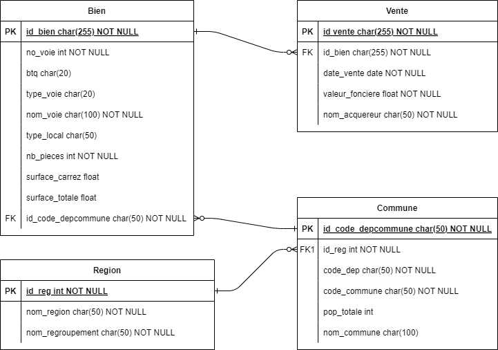

## P3 - Entraînez-vous avec SQL et créez votre BDD

### 1. Création du schéma relationnel



### 2. Création d'une base de donnée MySQL dans AWS

Connection à la base via :

```bash
mysql --local-infile -h db-laplace.cdccg8o6cj70.eu-west-3.rds.amazonaws.com -u admin -p
```

### 3. Requêtes SQL

```sql
SOURCE ./requete/create_tables.sql

SOURCE ./requete/load_data.sql

SOURCE ./requete/delete_tables.sql

SOURCE ./requete/count.sql
```