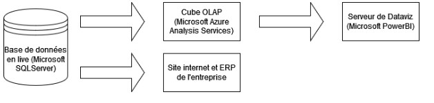
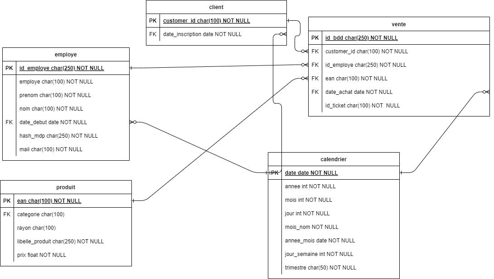
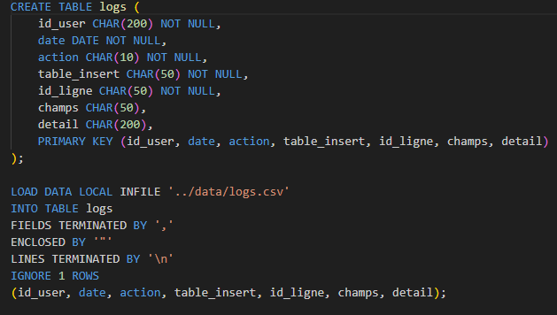
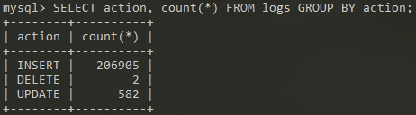
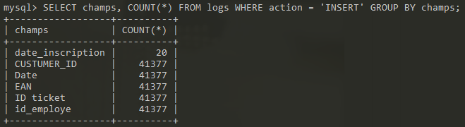
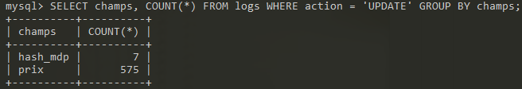
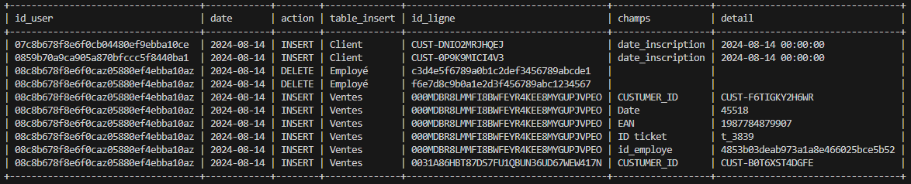
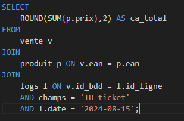
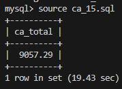
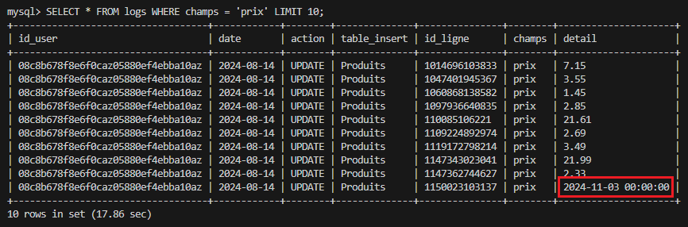

# P4 - Auditez un environnement de données

## Informations: 

**Entreprise** : `SuperSmartMarket`

**Mission** : Comprendre et analyser les différents flux de données de l'entreprise

## Schéma Architecture :



## Questions :

* Qu'est-ce qu'un cube OLAP ?


## Missions :

* Confirmer le CA pour le 14 août :
  * (275 186,59€ ou 284 243,88€)
* CA par client pour TOP 10 clients.
* CA encaissé par employé.

* Réaliser la base de donnée dans AWS

* Support de présentation :
  * Etude de l'architecture
  * Schéma relationnel
  * Dictionnaire de données
  * Résultats des requêtes
  * Etude du problème

# Etapes du projet :

# Partie 1

## 1. Notions importantes à comprendre

[Data Warehouse](https://fr.wikipedia.org/wiki/Entrep%C3%B4t_de_donn%C3%A9es)

[What is a Data Warehouse ?](https://www.startdataengineering.com/post/what-is-a-data-warehouse/)

Un data warehouse est généralement structuré pour faciliter l'analyse de grandes quantités de données historiques, avec une organisation en dimensions et faits qui permet de réaliser des analyses complexes, comme les tendances et les agrégations. Il utilise souvent une architecture en étoile ou en flocon de neige et est optimisé pour des requêtes en lecture intensive.

Au contraire, une base de données transactionnelle (OLTP) est optimisée pour les opérations CRUD (Create, Read, Update, Delete) rapides et fréquentes, et elle privilégie l'intégrité des données et la cohérence immédiate. Elle est principalement utilisée pour gérer les transactions courantes, comme les ventes ou les enregistrements clients, dans des systèmes opérationnels.

[Modèle en étoile](https://openclassrooms.com/fr/courses/7110891-realisez-des-dashboards-avec-power-bi/7212446-reliez-les-tables-pour-realiser-des-analyses-croisees)

Le modèle en étoile est une structure de base de données utilisée dans les entrepôts de données pour faciliter l’analyse rapide. Il comporte une table de faits centrale contenant des données quantitatives, entourée de tables de dimensions descriptives qui enrichissent les analyses. Les tables de dimensions sont non normalisées, ce qui augmente la redondance mais permet des requêtes plus rapides. Ce modèle est idéal pour les besoins en reporting et tableaux de bord interactifs.

## 2. Réaliser le schéma relationnel et le DD



Ce modèle de base de donnée est un modèle en étoile, avec `vente` comme table de fait centrale, et des tables de dimensions `client` `employe` `produit` `calendrier`.

On a aussi une table `logs` qui permet d'avoir un historique des actions `INSERT` `UPDATE` `DELETE` sur la les différentes tables de la base.

## 3. Créer la BDD

Connection à la base via :

```bash
mysql --local-infile -h db-market.cdccg8o6cj70.eu-west-3.rds.amazonaws.com -u admin -p
```


> La base n'est plus sur AWS

Lancer la base via WSL :

```bash
sudo service mysql start
sudo mysql --local-infile
```


Pour autoriser le chargement des données depuis un fichier local :

```sql
SET GLOBAL local_infile = true;
```

---

# Partie 2

## 1. Insérer les logs dans la BDD




### 2. Requete SQL pour comprendre logs

#### On regarde toute les actions qui ont été effectués dans les logs



#### Dans les `INSERT` :



- Ajout de nouveaux clients ==> date_inscription
-  41377 qui correspond bien au nombre de lignes de la table vente

#### Les `DELETE` :


* Correspond à deux employés qui ont étés supprimés

#### Les `UPDATE` :



* Mise à jour des prix et des mots de passe



## 2. Requete SQL pour comprendre logs

### A. *Problème du CA inconsistant*

---

 

> Les lignes ajoutées le 15 correspondent à la différence de CA observé

---


* Des données ont étés rentrées le 15 août pour le 14 août ce qui explique pourquoi le CA affiché sur Power BI était différent entre le 14 et le 16.
  
  * En regardant de plus près, on voit que certaines transactions (tickets) ont des articles qui sont traités le 15 alors que le reste de la commande est traité le 14 août.
  * Problème de gestion des transactions : l'ajout dans la base de donnée devrait se faire par `batch` pour éviter ce genre de problèmes.
    * Avant d'être ajouté défintiviement à la base de donnée, toute les lignes doivent êtres insérés avec succès.
  * C'est le principe d'`Atomicité` : Soit toute la transaction est enregistrée, soit rien.

### B. *Problème dans la mise à jour des prix*

---



> Un utilisateur a tenté de mettre à jour les prix avec une date.

---

* Dans les lignes de mise à jour des prix il y a des dates. Les produits correspondant dans la table produit ne sont pas des dates, une erreur a du être remonté.
   *  Action -> suppresion des lignes concernés des logs.
   *  Peut-être faudrait-il avoir une table de log dédié à chaque table ?
   *  On pourrait aussi avoir un check si champs = prix alors détails doit-être en float. `TRIGGER`

#### B.2 Pas d'historique des prix

* Aucune trace de la mise à jour des prix dans la table `produit`.

* Cela peut poser un prolbème de cohérence pour le calcul du CA.
  * On pourrait obtenir un faux CA après une mise à jour des prix.

> Mettre en place un système de suivit des prix ?

### C. *Suppression des employées*

---


---

*  Supprimer des employées pourrait corrompre la cohérence des données sur le long terme. Les clefs étrangères des lignes de vente qui corresponde à cette id_employe seront corrompu à la suite de ce DELETE.
   * Peut-être rejouter un status pour les employés qui ont quitté l'entreprise et ne supprimer que leur informations RGPD. 
   * Dangeureux de supprimer des clefs primaires/étrangères.

---

> **Plusieurs clients pour un ticket** : Anomalie ? Ou juste paiement partagé ?
  
### D. Plusieurs employées sur un ticket

```sql
SELECT 
    v.*
FROM
    vente v 
JOIN
    logs l ON v.id_bdd = l.id_ligne 
    AND l.detail = 't_3839';
```

* Présence de 2 employés sur 1 ticket.
* Présence d'un produit sur la commande qui est rentré le 15.

---

#### Problème du CA

## Partie 3

### 1. Réaliser un rapport d'audit

* Fromat pdf

# Rendu Final

## Support de présentation

* Architecture de la base
* DD
* shcéma relationnel
* requêtes et résultat
* Analyse des logs
* Présentation du problème idéntifié
* Mesures correctives à appliquer
* Le prototype de nouvelle base avec les mesures

## Rapport d'audit 
