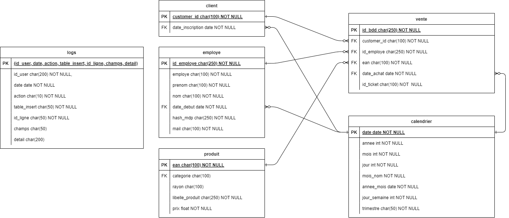
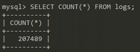
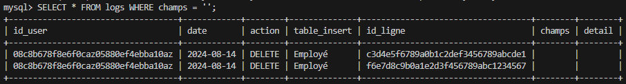

# P4 - Auditez un environnement de données

## Informations: 

**Entreprise** : `SuperSmartMarket`

**Mission** : Comprendre et analyser les différents flux de données de l'entreprise

## Schéma Architecture :


## Questions :

* Qu'est-ce qu'un cube OLAP ?


## Missions :

* Confirmer le CA pour le 14 août :
  * (275 186,59€ ou 284 243,88€)
* CA par client pour TOP 10 clients.
* CA encaissé par employé.

* Réaliser la base de donnée dans AWS

* Support de présentation :
  * Etude de l'architecture
  * Schéma relationnel
  * Dictionnaire de données
  * Résultats des requêtes
  * Etude du problème

# Etapes du projet :

## Partie 1

### 1. Notions importantes à comprendre

[Data Warehouse](https://fr.wikipedia.org/wiki/Entrep%C3%B4t_de_donn%C3%A9es)

[Modèle en étoile](https://openclassrooms.com/fr/courses/7110891-realisez-des-dashboards-avec-power-bi/7212446-reliez-les-tables-pour-realiser-des-analyses-croisees)

### 2. Réaliser le schéma relationnel et le DD



* Id_ticket vs id_bdd ???
* date clef primaire ?

### 3. Créer la BDD

Connection à la base via :

```bash
mysql --local-infile -h db-market.cdccg8o6cj70.eu-west-3.rds.amazonaws.com -u admin -p
```

> La base n'est plus sur AWS

Lancer la base via WSL :

```bash
sudo service start mysql
sudo mysql --local-infile
```


---

## Partie 2

### 1. Insérer les logs dans la BDD




### 2. Requete SQL pour comprendre logs

#### On regarde toute les actions qui ont été effectués dans les logs


#### Dans les `INSERT` :


- Ajout de nouveaux clients ==> date_inscription
-  41377 qui correspond bien au nombre de lignes de la table vente

#### Les `DELETE` :



* Correspond à deux employés qui ont étés supprimés

#### Les `UPDATE` :


* Mise à jour des prix et des mots de passe

---

#### Problème du CA

## Partie 3

### 1. Réaliser un rapport d'audit

* Fromat pdf

# Rendu Final

## Support de présentation

* Architecture de la base
* DD
* shcéma relationnel
* requêtes et résultat
* Analyse des logs
* Présentation du problème idéntifié
* Mesures correctives à appliquer
* Le prototype de nouvelle base avec les mesures

## Rapport d'audit 
