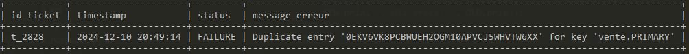

# Analyse détaillée de l’architecture des données relationnelles et du Cube OLAP de SuperSmartMarket

## 1. Introduction

### Contexte
SuperSmartMarket est une chaîne de supermarchés en pleine croissance en France, visant à révolutionner l’expérience client en intégrant des technologies de pointe. L’entreprise met l’accent sur l’hyper-personnalisation en magasin, notamment à travers des recommandations basées sur les historiques d’achat, des coupons promotionnels adaptés aux préférences des clients, et des recettes personnalisées. 

Dans ce cadre, une exploitation optimale des données est essentielle. Actuellement, des incohérences dans les données, notamment dans le calcul du chiffre d’affaires, empêchent l’entreprise de disposer d’une vue fiable et stable. Ces problèmes nuisent à la prise de décision stratégique et freinent l’ambition de SuperSmartMarket de devenir un acteur majeur de la personnalisation client.

L’audit est entrepris suite à l’intégration d’un Data Engineer au sein de l’équipe Data Support, une équipe chargée de garantir la qualité et la sécurité des données dans l’ensemble de l’organisation.

### Objectifs de l’audit
L’audit a pour principaux objectifs :
- Identifier et corriger les incohérences dans les données du chiffre d’affaires, notamment celles liées à l’évolution non explicable des valeurs historiques.
- Élaborer un dictionnaire des données documentant la structure et les caractéristiques des données utilisées.
- Produire un schéma relationnel détaillant la base de données OLAP de l’entreprise, en vue d’une meilleure compréhension et d’une documentation pérenne.
- Vérifier les chiffres d’affaires rapportés par Power BI pour des dates et des dimensions spécifiques (total, par client, par employé).
- Préparer un support de présentation clair et structuré pour partager les conclusions et les recommandations issues de l’audit.

### Périmètre de l’audit
Le périmètre de l’audit inclut les éléments suivants :
- Analyse de l’architecture existante des données, comprenant la base de données OLAP, les flux de données et les rapports générés dans Power BI.
- Vérification des données critiques liées au chiffre d’affaires, telles que le chiffre d’affaires global, le chiffre d’affaires par client (top 10), et la part encaissée par employé.
- Étude des processus de collecte, de stockage et de transformation des données au sein des outils de l’entreprise (Microsoft SQL Server, Azure Analysis Services, Power BI).

### Méthodologie

L’approche adoptée pour cet audit comprend :

- **Analyse documentaire** : Étude de l’architecture fournie et des documents fournis, notamment l'extraction OLAP.

- **Réalisation d’un Proof of Concept (POC)** : Création d’un prototype de base de données en local pour exécuter des requêtes SQL et comparer les résultats avec ceux rapportés par Power BI.
  
- **Entrevues et échanges** : Collaboration avec les membres de l’équipe Data Support pour comprendre les flux de données et les défis rencontrés.
  
- **Modélisation relationnelle** : Conception d’un schéma relationnel basé sur les observations et les analyses de la base de données OLAP.
  
- **Documentation** : Élaboration d’un dictionnaire des données détaillé et d’un support de présentation regroupant les conclusions et recommandations.
  
## 2. Structure relationnelle de la base de données opérationnelle

Le schéma relationnel de la base de données opérationnelle de SuperSmartMarket est constitué des tables suivantes :

1. **Table `logs`** :
   - Permet le suivi des actions des utilisateurs ou systèmes sur la base, avec des informations telles que l’identifiant de l’utilisateur, la date, l’action effectuée, et les champs concernés.
   - Contient des colonnes utiles pour l'audit, comme `action` (exemple : insertion, mise à jour) et `table_insert`, précisant la table concernée par l’action.

2. **Table `client`** :
   - Contient des informations sur les clients, identifiés par un `customer_id`.
   - Inclut des données telles que la date d’inscription.

3. **Table `employe`** :
   - Stocke les informations relatives aux employés, identifiés par un `id_employe`.
   - Contient des données personnelles (prénom, nom) ainsi que des détails de sécurité (hash de mot de passe).

4. **Table `produit`** :
   - Conserve les informations sur les produits, identifiés par leur code EAN.
   - Inclut des colonnes catégorielles (catégorie, rayon) et des informations tarifaires (`prix`).

5. **Table `vente`** :
   - Enregistre les transactions réalisées, reliant les clients, les employés, les produits et la date d'achat.
   - Chaque vente est identifiée par un `id_bdd` et contient des clés étrangères vers les tables associées.

6. **Table `calendrier`** :
   - Fournit une granularité temporelle pour les analyses, avec des colonnes pour l'année, le mois, le jour, le trimestre, etc.
   - Permet de structurer les dimensions temporelles dans un modèle analytique.

### Modèle en étoile et Cube OLAP

La base relationnelle décrite ci-dessus constitue la base idéale pour la construction d’un **Cube OLAP** dans l’architecture existante. Ce cube, hébergé sur Microsoft Azure Analysis Services, s’appuie sur un **modèle en étoile**, dont les caractéristiques sont les suivantes :

1. **Table de faits** :
   - La table `vente` joue le rôle de table centrale de faits. Elle contient des mesures quantitatives comme le montant des ventes ou la quantité de produits vendus, ainsi que les relations vers les dimensions associées (client, employé, produit, et calendrier).

2. **Tables de dimensions** :
   - Les tables `client`, `employe`, `produit` et `calendrier` représentent les dimensions, permettant d’analyser les ventes selon des axes tels que :
     - **Client** : Comportement et segments des clients.
     - **Employé** : Performance par employé.
     - **Produit** : Performance des catégories et des rayons.
     - **Temps** : Tendances par jour, mois, trimestre, ou année.

3. **Optimisation des analyses multidimensionnelles** :
   - Le Cube OLAP construit sur ce modèle en étoile permet de simplifier les analyses complexes grâce à la structuration des données en dimensions et en mesures.
   - Les dimensions sont enrichies avec des hiérarchies (par exemple, `jour -> mois -> trimestre -> année` dans la table `calendrier`) pour permettre des analyses rapides et intuitives.

#### **Data Warehouse et Power BI**

Bien que l’architecture actuelle ne mentionne pas explicitement un **Data Warehouse**, le Cube OLAP agit comme un entrepôt de données simplifié, consolidant et structurant les données pour des usages analytiques.

Les données issues du Cube OLAP sont exploitées par Microsoft Power BI, qui permet :
- **Des visualisations dynamiques** : Les données du modèle en étoile sont représentées dans des tableaux de bord interactifs.
  
- **Une exploration rapide** : Grâce à l’intégration directe avec Azure Analysis Services, les utilisateurs peuvent naviguer à travers les dimensions pour obtenir des insights à partir des mesures agrégées.
  
- **Une mise à jour automatisée** : Les tableaux de bord sont régulièrement actualisés, suivant les flux de données des sources transactionnelles.

____

## 3. Constats de l’Audit

### Présentation des constats

**Constat 1 : Chiffre d’affaires incohérent pour le 14 août**

- **Description** : Une différence a été observée dans le chiffre d’affaires du 14 août entre deux consultations. Initialement, ce chiffre était de 275 186,59 € puis il est passé à 284 243,88 €, soit une différence de 9 057,29 €.
  
- **Impact** : Ces incohérences dans les données compromettent la fiabilité des rapports et peuvent induire des erreurs dans les décisions stratégiques.
  
- **Preuve** : Après requête SQL sur la base de données, il apparaît que le chiffre d’affaires correct pour le 14 août est de 284 243,88 €.

Requête SQL utilisée :
```sql
SELECT 
    v.date_achat,
    ROUND(SUM(p.prix),2) AS 'chiffre_affaire'
FROM
    vente v
JOIN
    produit p ON v.ean = p.ean
GROUP BY 
    v.date_achat;
```


**Constat 2 : Problème dans la mise à jour des prix**

- **Description** : Des tentatives de mise à jour des prix ont été enregistrées dans les logs. Cependant, ces modifications n’ont pas impacté la table des prix, suggérant que la colonne des prix n’accepte pas les formats utilisés.
  
- **Impact** : Les erreurs de mise à jour peuvent conduire à des calculs de chiffres d’affaires incorrects si les prix ne sont pas mis à jour correctement. Ici, il semble s'agir d'erreurs. Cependant la table des logs à enregistré une ligne alors que la table produit n'a pas été modifié ce qui implique un problème de trigger des logs.
  
- **Preuve** : Les logs montrent la tentative de mise à jour mais aucune modification effective des prix.


**Constat 3 : Absence d’historique des prix**

- **Description** : La base de données ne conserve pas l’historique des prix, ce qui peut engendrer des incohérences lors de calculs de chiffres d’affaires historiques.
  
- **Impact** : Sans historique des prix, il est difficile de retracer les calculs effectués dans le passé, notamment après des modifications tarifaires.

**Constat 4 : Suppression des employés**

- **Description** : La suppression d’employés entraîne des incohérences dans les données liées aux ventes en raison de l’absence de gestion des clés étrangères.
  
- **Impact** : Cette pratique peut corrompre l’intégrité des données et générer des valeurs nulles dans les rapports.


**Constat 5 : Plusieurs employés sur un ticket**

- **Description** : Des anomalies ont été détectées où plusieurs employés sont associés à une même commande.
  
- **Impact** : Cela va à l’encontre de la logique métier et peut fausser l’attribution des performances.


### Évaluation des risques

Chaque constat présente un risque distinct en termes d’impact sur la qualité des données et la prise de décision. Les priorités seront établies en fonction de la gravité et de la probabilité d’occurrence.

## 4. Analyse des Résultats

### Analyse des écarts

Après analyse des logs, la fluctuation du CA observé dans le temps, serait enfaite dû à des transactions non atomiques. 

En effet, une partie des commandes n’est pas enregistré le jour même, mais le lendemain (15 août).

Certains articles sont enregistrés le 15 août à la date du 14 août. Si on calcule le CA des articles traités le 15 août, on obtient la différence qui a pu être observé dans le temps :

```sql
SELECT
   ROUND(SUM(p.prix),2) AS ca_total
FROM
   vente v
JOIN 
   produit p ON v.ean = p.ean
JOIN
   logs l ON v.id_bdd = l.id_ligne
   AND champs = 'ID ticket'
   AND l.date = '2024-08-15';
```


### Causes des écarts

- **Transactions non atomiques** : Des articles d’une même commande sont enregistrés à des moments différents, souvent sur deux jours consécutifs.

- Absence de validation des transactions (COMMIT).

```sql
SELECT
    l.date AS 'date_insertion',
    COUNT(*) AS 'nb_articles'
FROM
    vente v
JOIN
    logs l ON v.id_bdd = l.id_ligne
    AND l.detail = 't_3839'
WHERE
    v.id_ticket = 't_3839'
GROUP BY 
    l.date;    
```


Sur la commande t_3839 par exemple, on a 1 article qui a été inséré dans la base de données le 15, alors que le reste des articles à été inséré le 14.

## 5. Recommandations

### Recommandation 1 : Mise en place de transactions atomiques

- **Action proposée** : Implémenter des transactions atomiques en utilisant les commandes SQL `START TRANSACTION`, `COMMIT` et `ROLLBACK`.
  
- **Détails** : Cela garantit que toutes les opérations d’une transaction sont exécutées intégralement ou annulées en cas d’échec.
  
- **Bénéfices** : Réduction des incohérences et meilleure fiabilité des données. 
  
Une transaction atomique garantit que toutes les opérations d'une transaction sont exécutées intégralement ou annulées en cas de problème, assurant ainsi la cohérence des données dans la base. Dans l'exemple fourni, nous utilisons les commandes SQL START TRANSACTION, COMMIT, et ROLLBACK pour assurer cette atomicité.

Ceci est un exemple pour le ticket t_2828 traités le 2024-08-14 :


### Recommandation 2 : Mise en place d'une table de log des transactions


- **Action proposée** : Création d'une table `transaction_log`
  
Pour pouvoir superviser la bonne exécution des transactions, il est important de réaliser des logs de transactions.


Grâce à une procédure stockée, si une transaction échoue, une ligne est enregistré dans table de log des transactions, avec le message d'erreur associé.



### Recommandation 3 : Correction pour le trigger des logs

- **Action proposée** : La ligne qui correspond à l'`UPDATE` dans la table logs ne doit être inscrite que si la ligne correspondante est réellement mise à jour dans la table initiale.
  
```sql
DELIMITER //

CREATE TRIGGER log_price_update
AFTER UPDATE ON produit
FOR EACH ROW
BEGIN
    IF NEW.prix != OLD.prix AND NEW.prix > 0 THEN
        INSERT INTO logs (action, table_insert, id_ligne, champs, detail)
        VALUES ('UPDATE', 'produit', OLD.ean, 'prix', CONCAT('New price: ', NEW.prix, ', Old price: ', OLD.prix));
    END IF;
END //

DELIMITER ;
```
* Le `TRIGGER` vérifie à chaque `UPDATE` sur le prix, que le nouveau prix est bien différent pour le produit concerné, et que le nouveau prix est superieur à 0. Une inscription est faite dans les logs seulement si ces conditions sont remplies.

### Recommandation 4 : Historique des prix

- **Action proposée** : Dans la colonne détail qui ne renseignait précédement que le nouveau prix, on rajoute une trace de l'ancien prix. Cela permet en cas d'ereur de conservé une trace.


### Recommandation 5 : Historique des employés

- **Action proposée** : 
  - Ajout d'une colonne `status` qui renseigne si l'employé est `actif` ou `inactif`. Cette colonne à comme valeur de base **actif**
  - Ajout d'une colonne `date_fin` qui renseigne à quelle date l'employé à quitté l'entreprise.

* Plutôt que de supprimer directement l'employé, on change son status en *inactif* et on renseigne ça date de fin de contrat.

* Cela permet de garder une trace, et de conserver la cohérence des données plus longtemps.

## 6. Priorisation des recommandations :

1. **Mise en place de transactions atomiques** :  
   - **Niveau de priorité** : **Élevé**  
   - **Justification** : Les incohérences de chiffre d’affaires et l’instabilité des données proviennent en grande partie de l’absence d’atomicité dans les transactions. Sans ce socle garantissant la cohérence des écritures, toutes les autres corrections resteront fragiles. De plus, les transactions atomiques permettent d’assurer l’intégrité des données au plus près de leur source.

2. **Correction du trigger des logs et fiabilisation de l’historique des mises à jour (prix, employés)** :  
   - **Niveau de priorité** : **Élevé**  
   - **Justification** : Le trigger doit être corrigé afin que les logs reflètent correctement les opérations réelles. Parallèlement, la mise en place d’un historique des prix et la gestion du statut des employés (actif/inactif) permettent de conserver la traçabilité et la cohérence des données dans le temps. Ces éléments sont essentiels pour garantir que les analyses futures reposeront sur des données contextualisées et fiables.

3. **Mise en place d’une table de log des transactions et procédure de suivi d’erreurs** :  
   - **Niveau de priorité** : **Moyen**  
   - **Justification** : Bien que non critique à court terme, cette mesure contribue à une meilleure gouvernance des données à moyen et long terme. La journalisation des transactions complètes, couplée à un mécanisme de remontée d’erreurs, facilitera le diagnostic rapide des problèmes futurs et limitera leur impact.

4. **Gestion plus rigoureuse des données liées aux relations (employés, clients) et cohérence des clés étrangères** :  
   - **Niveau de priorité** : **Moyen**  
   - **Justification** : Il s’agit ici de renforcer l’intégrité référentielle en évitant les suppressions directes d’entités clés (par exemple, employés) ayant un impact sur les ventes. Bien que nécessaire, cette recommandation s’appuie sur l’existence préalable d’un socle transactionnel fiable et d’une bonne traçabilité.


## 7. Conclusion Étoffée :

Les constats de l’audit révèlent des dysfonctionnements structurants dans la façon dont les données sont collectées, mises à jour et historisées. La fiabilité du chiffre d’affaires, mesure critique pour toute décision stratégique, se trouve mise en cause par des mécanismes transactionnels incomplets et une absence de traçabilité historique. Ces lacunes affaiblissent la capacité de SuperSmartMarket à tirer parti de ses données pour personnaliser l’expérience client et prendre des décisions éclairées.

En adoptant une approche graduelle mais priorisée, SuperSmartMarket pourra rapidement restaurer la cohérence et la qualité de ses données. La priorité absolue doit être donnée à la mise en place de transactions atomiques, assurant ainsi une base solide et fiable. Dans la foulée, la correction des triggers, le suivi précis des mises à jour (prix, employés, etc.), et la journalisation intégrale des opérations apporteront une transparence indispensable. Enfin, à moyen terme, un renforcement des mécanismes de gouvernance (intégrité référentielle, gestion des statuts plutôt que suppression d’entités) consolidera les acquis et permettra de construire une architecture pérenne et évolutive.

En somme, le succès de SuperSmartMarket résidera dans une meilleure maîtrise de ses données, tant au niveau technique (transactions, logs, triggers) que méthodologique (historisation, intégrité référentielle). Cette maîtrise assurera une exploitation optimale des données pour soutenir une stratégie de personnalisation ambitieuse et durable.